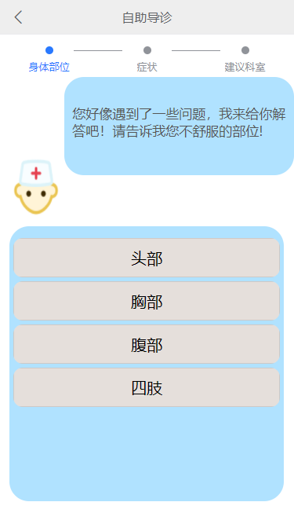

文档可以使用markdown编写，用[Pandoc](https://pandoc.org/)转成PDF、html或者word等格式。

# 一、项目介绍 [高鹏、韩晨旭、吴波]

## 1.1背景

医院是直接提供医疗服务的场所，而医疗服务直接关系着民生。所以提高医疗服务的水平是十分重要的，想要提高医疗水平的重要途径就是如何提高医院的工作质量和工作效率，这也和每一位患者息息相关。

本系统提供旨在实现病人在手机上预约看病的业务需求，让用户能更便捷地解决看病问题。也可以减少来医院挂号的人流量，人们只需在线上就能选择预约的科室以及时间段。

## 1.2项目需求分析

## 1.3计划和分工

高鹏：前端和后端设计实现，需求分析，API设计和测试，数据库设计，版本管理，项目部署

韩晨旭：前端设计实现，需求分析，API设计，项目部署

吴波：前端设计实现，需求分析，API设计

# 二、界面原型设计 [高鹏、韩晨旭、吴波]

## 2.1 登录注册

登陆界面需要接收用户名和密码，点击登陆跳转到首页，点击注册跳转到注册页面。

## 2.2 首页

​	首页采用底部导航栏设计方便用户页面的跳转。

### 2.2.1、医院介绍

有关医院的信息介绍，如历史、医生团队介绍、包含科室、位置等等。点击不同的模块跳转到相应的页面。

### 2.2.2、预约挂号

用户选择需要挂的科室，可以看到科室医生的信息，选择为自己或他人挂号，随后选择预约的日期以及时间即可。左上角可以返回。

### 2.2.3、自助导诊

用户根据自己的症状，可以了解应该挂的科室。

### 2.2.4、门诊记录

用户可以在此查看曾经的门诊记录，并且在详情中查看医生的会诊结果。

## 2.3 我

完成用户管理的操作，修改用户信息、退出登陆等。

### 2.3.1、修改昵称、密码

可以通过操作修改密码和昵称等信息。

### 2.3.2、意见建议

用户的意见建议会交由管理员查看处理

### 2.3.3、管理病人

用户可以添加、删除其他病人，之后可以为已添加的病人挂号。

## 2.4 页面跳转逻辑

# 三、系统架构设计 [高鹏]

## 3.1整体架构

- 业务分析：由于医院预约系统的性质，业务方面，用户需要分为医生、病人两种类型，同时为了方便系统的后台管理，还应加入管理员类型，因此共有三种用户类型。每个类型的用户有其不同的操作和需要保存的信息。
- 前端：分为web端和移动端两端。web端适合提供给医生和管理员使用，移动端适合提供给别人使用。web端需要实现的业务功能有：登陆，用户管理，医生会诊等。移动端需要实现的业务功能有：登陆注册，修改用户信息，预约挂号，查看预约记录，自助导诊，医院介绍等。
- 后端：后端根据业务逻辑创建不同的控制类，根据API文档开发相关接口。采用MSCM架构，controller控制层，通过service的接口来控制业务流程，也可通过接收前端传过来的参数进行业务操作。model数据模型层，存放实体类，与数据库中的属性值基本保持一致。service业务逻辑层，主要是针对具体的问题的操作，把一些数据层的操作进行组合，间接与数据库打交道。 mapper数据存储对象，mapper层直接与数据库打交道（执行SQL语句），接口提供给service层。
- API：使用APIfox进行接口设计和管理，并完成接口测试。方便快捷，易操作。
- 数据库：根据业务逻辑，大致需要4个表，医生表、病人表、科室表、预约表。因为病人和医生是有预约关系的，一个病人可以预约多个医生，一个医生也可被多个病人预约，他们存在多对多的关系，因此需要一个中间表即预约表来反映这种关系。预约表中需要有病人id和医生id属性作为外键，在需要查询的时候，只要通过级联查询三个表即可。

## 3.2实现方案

### 3.2.1前端

- web端：①VUE3框架，简化对DOM元素的操作，提升开发效率；②axios，实现对后端接口的调用；③element-plus组件库，使用其提供的组件，提升开发效率，提高页面美观度。

- 移动端：①uniapp框架，同样基于vue，减少开发的学习成本，简化对DOM元素的操作，提升开发效率。并且该框架一套代码即可发行到小程序、安卓、苹果三大平台；但是由于同时发布多平台的特性，会导致在真机测试时，不同的机型不可避免的会碰到一些兼容性问题，小则页面组件问题，大则会碰到某些插件无法使用的情况。②uView1.8组件库，使用其提供的组件，提升开发效率，提高页面美观度。

### 3.2.2后端

- Springboot框架，配置简单，内嵌servlet容器。方便接口编写，减少了大量的开发时间并提高了生产力。
- mybatis：易于上手和掌握。sql写在xml里，便于统一管理和优化。解除sql与程序代码的耦合。提供映射标签，支持对象与数据库的orm字段关系映射提供对象关系映射标签，支持对象关系组建维护。但是sql工作量很大，尤其是字段多、关联表多时，更是如此。
- mybatis-plus：解决了mybatis的sql工作量大的缺点，一些简单的数据库操作不需要手动写sql语句，并且提供了方便的分页查询功能，减轻了前端开发的工作量。不过它也只适合实现一些简单的业务操作，不适合复杂的应用场景，如级联查询等，因此还需穿插使用mybatis。
- lombok：能通过注解的形式自动生成构造器、getter/setter、equals、hashcode、toString等方法，提高了一定的开发效率让代码变得简洁，不用过多的去关注相应的方法，属性做修改时，也简化了维护为这些属性所生成的getter/setter方法等。
- maven：Maven能提供一种项目的配置，配置好的项目，只需要运行一条简单的命令，就能完成重复的，繁琐的构建动作。Maven能提供一种项目的依赖配置。可以自动的导入项目依赖的jar，并且自动导入这些jar包依赖的第三方的jar包。

### 3.2.3数据库

通过对项目中需要持久化的数据的分析，本项目只需使用关系型数据库mysql即可。

# 四、API设计 [高鹏、韩晨旭、吴波]

所有接口都使用APIfox进行了测试并保存了测试用例。

## 4.1医生端模块

### 4.1.1医生用户需要的API

- 查看预约自己的病人[GET]：每个医生都要给预约自己的病人会诊，因此需要医生能够获取到预约自己的病人列表。web端采用分页查询，因此请求参数要带上页面信息（页号、页面大小），此外还要带上医生自己的id，通过id查询。凡是涉及到web端获取表格信息的API都需要带上页面信息，因此之后的API不再过多赘述。
- 医生会诊[PUT]：医生给一个病人会诊，将会诊结果传给后端，这一过程只需要2个参数，病人id用于确定是哪个病人，结果result是诊断的结果。

### 4.1.2管理员用户需要的API

- 修改医生信息[PUT]：要修改医生的信息，需要将要修改的参数打包成JSON对象传给后端，其中必须传的属性是id。后端根据id确定修改哪个用户，判断还传了什么属性，在数据库中做出相应修改。
- 加载所有医生信息[GET]:管理员在页面中查看所有的医生，因此需要用到分页查询，请求参数为4.1.1中提到的分页查询参数。后端查询医生表的所有信息，传回前端。
- 加载所有病人信息[GET]:原理同上，请求的接口地址为patient。
- 获取所有预约记录[GET]:原理同上，请求的接口地址为yuyue。
- 通过姓名查询医生[GET]:传入分页查询的参数，还有search参数为查询的医生姓名。后端通过查询的医生姓名，在表中查询是否有这条医生数据，如果有就返回该医生信息到前端，如果没有则返回空列表。
- 通过姓名查询病人[GET]:原理同上。
- 删除病人用户[DELETE]:传入用户的id确定要删除哪个用户。后端执行删除操作。将操作结果返回。
- 删除医生用户[DELETE]:原理同上。
- 新增医生用户[POST]：管理员在页面中给出医生各项信息，将信息传给后端，后端查询用户名是否已经存在，如果存在则返回用户名已存在，如果不存在则在医生表中添加数据。

### 4.1.3通用API

- 登陆[POST]：用户登陆，需要将用户输入的用户名密码传给后端，后端先通过用户名查询有没有这一项用户数据，如果没有，则返回用户名错误；如果有，则比对密码是否正确，如果不正确，则返回密码错误；如果正确，则返回登陆成功，并把用户的信息传回前端，前端将用户信息缓存起来，随后进入系统。
- 通过病人姓名查询预约记录[GET]：医生和管理员都能通过病人姓名查询预约记录。传入三各参数，两个为分页查询参数，一个为查询的病人姓名。具体实现和4.1.2通过医生姓名查询类似。

## 4.2病人端模块

- 病人登陆[POST]:实现同医生端相同，区别在于接口地址以及查询的表不同。
- 病人注册[POST]:前端接收用户输入的病人姓名，用户名，密码，性别这些用户参数，传给后端，后端首先通过查询用户名是否已经存在，如果用户名已存在，则拒绝注册，返回用户名已存在；如果不存在，则可以注册，在表中加入该用户的数据，id自增。
- 病人预约挂号[POST]:病人将预约信息传给后端，预约信息包括医生和病人的id，预约时间，预约状态status（默认为0，0代表预约还未完成会诊）。后端将接收到的预约信息做一下简单的验证，然后将该预约记录新增到预约表中。
- 修改病人信息[PUT]：修改信息的原理与4.1.2中的修改信息一致。
- 通过科室查询医生[GET]：前端需要查询某一科室下的所有医生，因此将科室名传给后端，后端通过科室名到医生表中查询，将查询到的医生信息返回给前端。
- 取消预约或删除预约记录[GET]：病人可以取消还未会诊的预约，管理员和医生可以删除一些过期的预约记录。前端传给后端预约的id，后端根据id删除对应记录，将结果返回前端。
- 病人查看自己的预约历史[GET]：病人传给后端自己的id，后端通过病人id查询该病人的所有预约记录，返回前端。
- 获取科室信息[GET]：获取所有的科室信息。

# 五、数据库设计 [高鹏]

## 5.1持久化设计

1. 用户的信息，包括医生和病人两类用户，分别建立两个表（t_doctor、t_patient），两个表都以id作为主键，作为唯一地识别每个用户的标识，其次，两个表同样拥有的属性有用户名（username），密码（password），性别（sex）三个，前两项用于实现用户的登陆功能，sex属性存放用户的性别属性。同时两表还需存放各自 姓名（name）的属性。
2. 科室信息，科室的属性特性，只需要主键id和科室名（department）即可，与医生表（t_doctor）形成1对1的关系，一个医生对应一个科室。
3. 预约信息，为了实现病人预约医生的功能，并且这之间存在多对多的关系，一个医生可以会诊多个病人，一个病人也可以预约多个医生，因此需要一个第三方表来持久化这之间的信息。建立一张预约表（t_yuyue）。属性有主键id；病人id（patient_id）对应预约的病人的id，医生id（doctor_id）对应预约的医生的id；预约时间（time）存放预约的时间；结果（result）存放医生的诊断结果，初始为空；状态（statue）标志此次预约的状态，状态为1表示已经会诊完毕，状态为0表示还未会诊。

综上，我选择使用关系型数据库MySQL来持久化数据。

ER图：

.png)

## 5.2数据库

| t_doctor    |         |      |          |
| ----------- | ------- | ---- | -------- |
| 属性名      | 类型    | 主键 | 注释     |
| id          | int     | 是   | id       |
| username    | varchar |      | 用户名   |
| password    | varchar |      | 密码     |
| doctor_name | varchar |      | 医生名称 |
| department  | varchar |      | 科室     |
| sex         | varchar |      | 性别     |

| t_department |         |      |        |
| ------------ | ------- | ---- | ------ |
| 属性名       | 类型    | 主键 | 注释   |
| id           | int     | 是   | id     |
| department   | varchar |      | 科室名 |

| t_patient    |         |      |          |
| ------------ | ------- | ---- | -------- |
| 属性名       | 类型    | 主键 | 注释     |
| id           | int     | 是   | id       |
| username     | varchar |      | 用户名   |
| password     | varchar |      | 密码     |
| patient_name | varchar |      | 医生名称 |
| sex          | varchar |      | 性别     |

| t_yuyue    |         |      |          |
| ---------- | ------- | ---- | -------- |
| 属性名     | 类型    | 主键 | 注释     |
| id         | int     | 是   | id       |
| patient_id | int     |      | 病人id   |
| doctor_id  | int     |      | 医生id   |
| time       | time    |      | 预约时间 |
| result     | varchar |      | 诊断结果 |
| statue     | int     |      | 状态     |

## 5.3数据库技术

本项目使用到的数据库技术有：JDBC 、mybatis、mybatis-plus、ORM、lombok。

项目使用JDBC实现后端与数据库的连接。

采用对象关系映射（Object Relational Mapping，简称ORM）模式，这是一种为了解决面向对象与关系数据库存在的互不匹配的现象的技术。ORM框架是连接数据库的桥梁，只要提供了持久化类与表的映射关系，ORM框架在运行时就能参照映射文件的信息，把对象持久化到数据库中。本项目在后端entity目录下创建java对象的实体类映射数据库中的各表，同时在mapper目录下创建每个实体类对应的mapper接口以及mapper.xml文件，完成mybatis的配置。

mybatis-plus用来实现一些简单的数据库增删改查操作，相较于mybatis，它的使用更方便，对于简单的操作逻辑，无需程序员手写sql语句，已经帮我们自动生成了，同时，他也能支持分页查询，方便了web端的页面展示。但是对于一些较为复杂的操作逻辑，比如多表查询，mybatis-plus的效果就不太够了，因此还得使用mybatis来处理一些较为复杂的操作逻辑。

# 六、前端的实现 [高鹏、韩晨旭、吴波]

本项目前端分为web端与移动端，面向不同的用户。

医生和管理员用户使用web端，医生可以通过系统查看预约了自己的病人，然后对其进行会诊，给出诊断结果。管理员可以通过系统查看并管理病人用户，医生用户，也可查看所有的预约记录。

病人使用移动端，进行预约挂号，查看自己的会诊记录等等。

使用的技术：

- vue3框架，简化对DOM元素的操作，提升开发效率
- axios，实现对后端接口的调用，我们将其封装成request工具类，位置在utils\request.js，以此简化使用axios的操作。
- element-plus组件库，web端使用其提供的组件，提升开发效率，提高页面美观度
- uniapp框架，同样基于vue，减少开发的学习成本，简化对DOM元素的操作，提升开发效率。并且该框架一套代码即可发行到小程序、安卓、苹果三大平台。
- uView1.8组件库，移动端使用其提供的组件，提升开发效率，提高页面美观度。

前端与后端的交互不是完全顺利的，会存在跨域问题，通过前端设置代理的方式解决跨域的问题。

## 6.1web端（医生端）的实现

​	为了提高页面的美观性，web端组件使用element-plus组件库。

### 6.1.1用户管理的实现

1. 用户登陆：由于web端是工作后台端，因此没有提供注册入口，登陆界面输入用户名和密码，点击登陆后，将数据转化成json格式，通过axios调用后端登陆接口，接收后端返回的数据并做出判断，如果接收到的返回码是0，则代表用户名，密码正确允许登陆。如果登陆是成功的，后端会在返回的数据中给出用户的各项属性，此时前端通过sessionStorage将本用户的属性保存起来，然后跳转到后台页面。同时加入拦截，防止用户在未登录状态下访问内部页面。

1. 加载、查询操作：管理员可以管理病人和医生用户，以管理员的账号登陆后，会看到左侧导航栏有角色管理这一模块，可以选择管理医生或是病人，点击进入管理界面时，前端通过axios调用后端加载所有接口，将获取到的医生或病人信息展示在页面上，由于用户众多，需要分页查看，可以修改页面的大小，或是查看不同的页，分页查询的功能实现主要在后端，因此前端调用加载接口时，还需传入页面大小，页数这两个参数。这样做简化了前端逻辑，将分页逻辑交给后端。
2. 查询操作：通过左上角的查询框，输入医生或病人姓名查询对应用户的信息。将查询框输入的内容打包成json，通过axios调用后端查询接口，后端返回查询结果，前端将结果在表格中展示。
3. 新增医生操作：医生用户的创建需要通过管理员操作，在医生管理界面有相应入口，输入要新增医生用户的相应数据，点击确定，将输入的内容传给后端，判断后端的返回确定是否创建成功，成功后刷新页面
4. 修改、删除用户操作：在每个用户条目上有一列为操作，可以选择编辑用户或是删除用户，编辑则可以对该用户数据进行修改，然后提交给后端，判断后端的返回确定是否创建成功，成功后刷新页面。删除同理，成功后刷新页面。

### 6.1.2会诊的实现

​	医生用户进入系统后，可以在预约查看页面看到预约自己的病人，也可以通过查询框输入病人姓名查询。表格中的操作列有诊断和删除两项，医生点击诊断，弹出诊断框，医生输入给出的诊断结果，点击确定，将结果传给后端，后端返回操作结果，前端判断结果，如果成功，则提示成功并刷新页面，失败则提示失败。

## 6.2移动端（病人端）的实现

​	为了提高页面的美观性，移动端组件使用uview组件库。

​	为了提示用户体验，采用自定义的顶部导航栏，采用uview的navbar，因为原生的导航栏不能方便地修改样式，并且无法方便地设置返回按钮，而自定义导航栏就可以方便地控制返回按钮的有无以及自定义样式等。

### 6.2.1 用户管理的实现

1. 用户登录、注册功能：病人用户需要自己注册账号，因此在登陆界面提供注册入口。注册界面，需要一个表单接收用户输入的信息。点击提交后，把表单内容提交给后端，接收后端传回的返回内容，判断注册是否成功，成功则跳转回登陆界面。否则提示注册失败。用户登陆则输入用户名密码，将内容传给后端，判断是否登陆成功，成功则跳转到首页界面。成功与失败的提示通过toast形式，登陆成功时会显示欢迎您，xxx！（xxx为用户姓名）。
2. 我页面：该页面用于展示用户的信息，用户名，姓名，性别等，其中性别的展示采用头像图片的形式，会根据男女展示不同的头像。还包括修改姓名和密码的功能，通过调用后端接口将要修改的内容传给后端。最后有退出登陆按钮，点击后清空本地的用户数据sessionStorage，跳转到login界面，跳转的方式要用uni.reLaunch，这样用户就不能通过手机的返回功能返回内部界面。

### 6.2.2 首页界面设计

​	首页为了界面美观，顶部设置轮播图，展示一些活动内容和标语。同时要做到能方便地访问主要的功能，采用uview的宫格布局，方便用户迅速了解到系统的功能，然后方便地进行页面切换。

### 6.2.3医院介绍功能实现

​	为了方便用户更好地了解商大医院，医院介绍模块会分几个模块介绍商大医院，如概况、医疗资源、科研成果、获奖荣誉、先进设备等。文本量不大且是静态的，因此将文本存放在前端页面中。使用uview的collapse折叠面板，让页面能塞下更多内容并且更易阅读。

### 6.2.4自助导诊功能实现

​	为了展现更好的用户交互界面以及用户体验，自助导诊界面采用一对一医生病人对话形式，让病人感到被服务的温馨，导诊分三步，因此在顶部加入uview的steps组件，显示当前导诊进度，首先医生询问病人不舒服的身体部位，再根据部位询问病人的具体症状，最后给出建议病人预约的科室。如果病人感觉回答有误，可以在最后选择重新咨询，如果接受建议，可以点击”带我去挂号“，然后跳转到挂号页面。

### 6.2.5预约功能实现

​	用户进入预约界面，顶部是导航栏，可以返回上一级页面。接着是一个uview组件notice-bar，温馨提示用户如果对挂号有疑问可以前往自助导诊。不同科室的展示使用uview的tabs-swiper和swiper搭配使用实现，医生列表的滑动使用scroll-view，但是由于scroll-view的一些问题，导致医生列表的大小无法调大，一旦调高高度，就无法滚动页面，并且高度也不会变高。医生信息中根据医生性别展示不同的icon。

​	进入页面首先需要向后端请求科室信息，把获取到的科室存入swiper对应的数组，用来做为tab科室索引，接着就需要获取各个科室有什么医生，一开始的设计中，只是在一个for循环中简单地用科室去一次次地请求后端获取每个科室对应的医生信息存入对应的科室界面数组中，但是在一次次地测试中发现，如果采用这种方式，科室和对应的医生总是会出现不正确的情况，随后加入log输出查看原因，根据输出发现原来因为axios请求的异步性，每个科室接收到的一次后端医生信息返回并不一定是该科室的，他们到达的时间顺序是不确定的，因此重新思考了解决方案。最后的实现方案是，load界面时就直接获取所有的医生信息，然后在获取科室信息，在前端中把医生归类到各个科室页面。有时候页面可能会更新不及时，因此加入下拉刷新功能，uniapp有提供方便的相应实现，在pages.json中配置，接着在页面中，改写下拉刷新方法onPullDownRefresh，把页面刷新的方法写入即可，然后结束刷新的动画。

​	前面介绍了获取医生列表的实现，接着是用户预约功能的实现，用户根据要预约的科室，要预约的医生，点击该要预约的医生，弹出uveiw提供的picker组件，接收用户要预约的时间。由于uview1.8的picker提供的参数无法对时间的选择做出限制，因为预约的日期只能预约不包括今天的后7天，因此需要对年月日做出限制，并且具体时间要在工作时间内，即每天的8-16点，所以小时也要做出限制。所以我修改了他的源码，在源文件目录uview-ui/components/u-picker/u-picker.vue。修改从第429行开始，将作出修改的源码注释，编写符合本系统的时间显示逻辑。最终达到了目的。这样用户选择正确的时间了，选好后点击确定，将用户的信息还有预约的医生的id以及预约的时间信息传给后端，接收返回内容，判断是否预约成功，将结果用toast提示。

### 6.2.6门诊记录功能实现

​	该页面需要展示用户号的预约记录，预约记录分两类，一类是已经完成就诊了，用户需要查看医生的诊断结果；第二类是还未就诊，用户需要查看预约的信息，时间、科室、医生等。通过本用户的id向后端请求该用户下的预约记录。在前端通过记录的statue属性进行分类，为0则是未就诊，1则已就诊，放入不同的数组。通过v-if实现两个页面的切换。

​	在待就诊的页面中，用户可以取消预约，向后端发送该预约记录的id，等待后端的返回，如果成功则toast提示成功，并且刷新页面。

## 6.3前后端通信的实现

​	前后端通信，采用http协议，使用axios请求库。

​	首先会遇到的问题就是跨域问题。因为本项目两个前端内容都使用了vue框架，因此解决这一问题的方式就可以通用，在前端设置代理的方式实现。成功解决问题。

# 七、后端的实现[高鹏]

说明：后端实现使用的技术在系统架构设计中已列出。

## 7.1全局配置

​	在application.properties中设置端口和数据库连接信息。创建common包放入一些代码的通用部分如一些工具类，controller包放下控制类，entity包放实体类，mapper包放mybatis的mapper映射接口和mapper配置文件。目录结构如下：

## 7.2 common模块

- MybatisPlusConfig：因为web端需要在表格中展示信息，用分页的展示方式显然方便，把这一分页操作交由后端完成，每次请求获取只要带上页号和页面大小即可，可以使用mybatis-plus提供的分页插件，根据官方文档，配置该类，即可使用分页插件。
- Result：返回给前端的信息除了一些前端请求的数据外，还要返回一些返回码和提示信息，这类代码是重复的写起来很繁琐，因此写了这个工具类简化这一操作。

## 7.3 entity模块

​	每个entity对应数据库的一张表，使用lombok插件提供的注解@Data @AllArgsConstructor @NoArgsConstructor，来自动配置getset、tostring、构造方法等一系列方法，这样配置不仅方便，而且代码长度看起来也短，更易于阅读，如果不使用插件，自己手写方法，那么每次新加一个属性或是有什么修改都需要重写所有的方法，工作量很大且无意义。

​	我在编写预约功能时，面临一对多查询的需求，需要采用级联查询，需要解决实体类对应数据库数据的问题，因为级联查询的有些属性是不属于预约表的。需要在预约实体类中加入两个列表，分别是医生和病人列表，这些属性不属于预约表，使用@TableField注解表示数据库不存在的字段，而java需要使用，然后在mapper中编写对应的sql语句，下面会具体说明。解决了这一问题后，随后又碰到了一个问题，就是别的java类的数据查询到后无法放进预约类中定义的该java类中，经过一番寻找原因，发现是因为那些java类没有编写构造方法，使用lombok的@AllArgsConstructor@NoArgsConstructor注解，问题得以解决。

## 7.4 mapper模块

​	因为使用mybatis，需要mapper来定义sql方法。在开发中，等多的功能只需要用到mybatis-plus提供的方法就可以完成，无需自己编写，而碰到一些较复杂的逻辑功能时，则需要使用mybatis手动编写和配置。如上一模块中提到的级联查询这样的复杂问题。

# 八、系统测试[高鹏]

## 8.1 单元测试

使用APIfox进行单元测试，测试了每一个API接口，并且都保存了测试成功的用例，部分接口除了成功用例外还有一些失败用例。

接口数：21，测试数25，覆盖率100%

## 8.2 集成测试

自动化测试用例如下：

以【医生登陆并完成一次会诊】的自动化测试为例：

# 九、系统部署 [高鹏、韩晨旭]

部署到阿里云服务器。使用宝塔面板便捷部署。

- 在服务器配置数据库

- 把前后端项目中原来的路径改成服务器的

- 将项目jar包和配置信息application.properties上传到服务器

- 在服务器运行jar包

- 测试访问接口成功

- 使用nohup跑项目，让项目不中断

将前端访问的后端地址修改为服务器的地址测试，可以正常访问后端接口，云服务器部署完成。

# 十、功能展示 [高鹏、韩晨旭、吴波]

功能展示另附视频，在清单中列出。

# 十一、清单 [高鹏、韩晨旭、吴波]

- 移动端前端代码: codes\uniapp项目
- web端前端代码:codes\shangdaHospital\vue项目
- 后端代码: codes\shangdaHospital\houduan项目
- 原型设计文件: docs/design目录
- 项目演示视频: docs/videos目录
- API文档：docs/design/商大医院API.md

# 十二、总结 [高鹏、韩晨旭、吴波]

​	本节课通过着手一个项目学到了很多，一步一步完成一个项目，从最初设定的原型，眼看着一个个页面的完成，一个个小功能的实现，最后做出一个完整的系统，内心十分有成就感。本项目完成了多用户的操作，实现了病人从需要预约到就诊的整个流程的功能。也完成了医生上班给病人会诊的业务流程。经过一次次地碰到问题，解决问题的过程，在项目开发、开发中的合作、语言的运用、前后端操作方面都收获了深刻的体会和经验。在开发中常常会因为一个bug要调试一整晚，但从没想过放弃，最后都找到了解决方案，完成预期的功能。经过一学期的课下来，觉得韩老师是少有的特别愿意把工作重心放在培养同学项目开发规范性的老师，他在课堂上分享介绍了很多公司实际开发中用到的技术，有的头一回听说，有的听说过没有机会动手使用的，老师都鼓励让我们去用一用，对我们综合能力的培养很有帮助。之后我们会好好总结这次项目的经验，在以后的开发过程中少走弯路。

# 十二、参考文献 [高鹏、韩晨旭、吴波]

- uni-app: https://uniapp.dcloud.io/ 
- springboot：https://spring.io/projects/spring-boot
- vue3：https://cn.vuejs.org/
- mybatis-plus：https://baomidou.com/
- uview：https://v1.uviewui.com/components
- element-plus：https://element.eleme.io/#/zh-CN/component/table
- iconfont：https://www.iconfont.cn/

